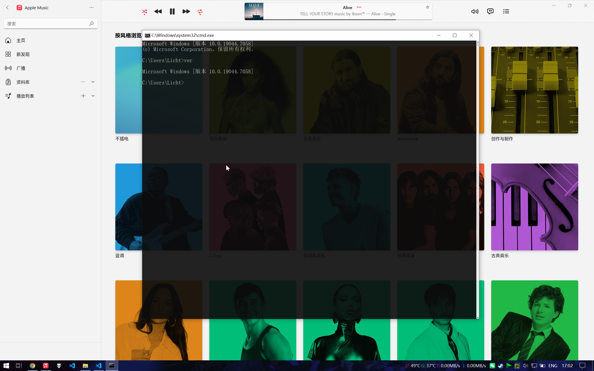

## 简介信息

Apple Music Windows 版本只在 Windows 11 26100.0 及更高版本系统上提供官方支持。

Apple Music Windows 版本只能通过 Microsoft Store 安装。

因此需要绕过这两个需求。

## 系统配置
| 系统 / 软件包                                    | 版本            |
| ------------------------------------------------ | --------------- |
| Windows 10 (Windows 10 IoT Enterprise LTSC 2021) | 21H2 (19044)    |
| Microsoft.WindowsAppRuntime.1.2                  | 2000.684.1510.0 |
| Microsoft.VCLibs.140.00.UWPDesktop               | 14.0.30704.0    |
| Microsoft.VCLibs.140.00                          | 14.0.30704.0    |

## 安装步骤

### 下载安装包

1. 打开网站 [Microsoft Store generation Project](https://store.rg-adguard.net/)。
2. 使用 URL 方式搜索软件包，URL 为 `https://apps.microsoft.com/detail/9pfhdd62mxs1`。
3. 或者使用 ProductId 方式搜索软件包，ID 为 `9pfhdd62mxs1`。
4. 下载文件名结构为 `AppleInc.AppleMusicWin_***_neutral_~_nzyj5cx40ttqa.msixbundle` 格式的文件。
5. 使用解压缩软件解压 msixbundle 文件，再解压其中文件名结构为 `MusicPackage_***_x64.msix` 格式的文件。
6. 将解压 msix 后得到的文件整理到 `Apple Music`目录中，并移动到软件安装目录，例如 `C:\Program Files (x86)`。

### 修改文件

移除 Apple Music 中的下列目录或文件：

- `AppxMetadata`
- `[Content_Types].xml`
- `AppxBlockMap.xml`
- `AppxSignature.p7x`

将 `AppxManifest.xml` 文件中 `TargetDeviceFamily` 的 `Min Version` 字段修改为 `10.0.19044.0` 。

### 注册软件包

1. 在 Apple Music 目录中使用管理员权限打开 PowerShell。
2. 运行命令 `Add-AppxPackage -Register .\AppxManifest.xml`。
3. 注册完成后，Apple Music 会出现在开始菜单中。

### 更新软件包

当 Apple Music 发布新版本时，重复上述步骤，下载新版本的安装包，解压并修改文件后再次注册即可。

## 预览

