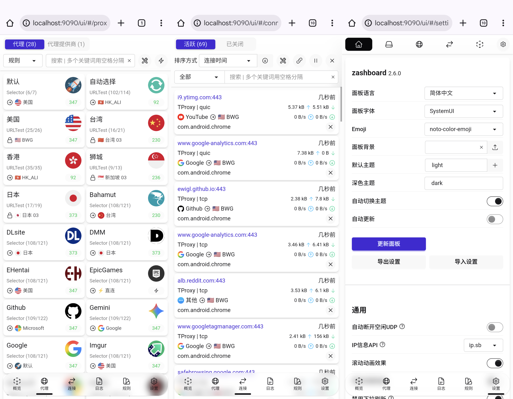

## 预览




## 配置 - Windows

- 从 [Release](https://github.com/ewigl/mihomo/releases/latest) 下载 `windows-*.zip`，解压缩。
- 整理现有文件到如下目录结构。

### 目录结构

```
D:/Apps/Mihomo/
├── config.yaml
├── mihomo-windows-amd64.exe
├── mihomo.start.vbs
├── Mihomo.Startup.xml
├── mihomo.stop.bat
├── zashboard/
│   ├── index.html
│   └── ...
└── proxies/
    └── Local.yaml
```

### 配置流程

1. 添加订阅链接：在 `config.yaml` 文件中的 `proxy-providers` 中添加订阅链接，有多个订阅复制多份，名称不重复即可。

    ```yaml {filename="config.yaml"}
    proxy-providers:
      Subscription:
        type: http
        # 将下面的订阅链接，改成你自己的。
        url: http://192.168.8.1:8848/proxy-providers.yaml
        health-check:
          enable: true
          url: http://www.gstatic.com/generate_204
          interval: 86400

      其他订阅源:
        type: http
        url: 这里填订阅链接
        health-check:
          enable: true
          url: http://www.gstatic.com/generate_204
          interval: 86400
      
      本地文件作为订阅源:
        type: file
        url: 这里填文件相对路径
        health-check:
          enable: true
          url: http://www.gstatic.com/generate_204
          interval: 86400
    ```

2. 在 `mihomo-windows-amd64.exe` 上右键 -> 属性 -> 兼容性，勾选`以管理员权限身份运行此程序` **(Tun 模式需要管理员权限)**。
3. 双击 `mihomo.start.vbs` 使程序在后台运行，或双击 `mihomo.start.bat` 使程序在前台运行（会始终显示一个"小黑框"）。

4. 浏览器访问控制台：[http://localhost:9090/ui](http://localhost:9090/ui)。

### 开机自启

1. 打开 Windows 任务计划程序
2. 导入 `Mihomo.Startup.xml`，或新建一个任务来开机运行 `mihomo.start.vbs`.
3. 按需修改任务名称、**文件路径**、触发器、条件等等。
4. **在“常规”选项卡中， 勾选“使用最高权限运行”**。（如果不设置此选项，每次启动会跳出 UAC 窗口）

### 停止运行

后台运行时：运行 `mihomo.stop.bat` 或 `mihomo.stop.vbs`，也可以打开任务管理器，结束 `mihomo-windows-amd64.exe` 进程。

前台运行时：直接关闭“黑框”窗口即可关闭程序。

## 配置 - Android

1. 获取手机 Root 权限。
2. 从 [Release](https://github.com/ewigl/mihomo/releases/latest) 下载 `android-*.zip`，解压缩。
3. 下载 [Box for Root](https://github.com/taamarin/box_for_magisk/releases)，使用模块管理器刷入模块，**无需立刻重启**。
4. 整理现有文件到如下目录结构，`/data/adb/box/`为绝对路径。

### 目录结构

```
.
└── /data/adb/box/
    ├── bin/
    │   └── xclash/
    │       └── mihomo
    └── clash/
        ├── proxies/
        ├── zashboard/
        └── config.yaml
```

### 配置流程

1.  参考 Windows 配置流程在 `config.yaml` 中添加订阅。
2.  重启。
3.  浏览器访问控制台：[http://localhost:9090/ui](http://localhost:9090/ui)。

### 注意事项

在模块管理界面, 可以使用“执行”按钮来运行、停止 mihomo。

## 提醒

这是实现 Tun 模式的简单配置，使用默认 DNS，官方规则集。

更多定制功能请参考[官方文档](https://wiki.metacubex.one/)。
