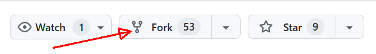
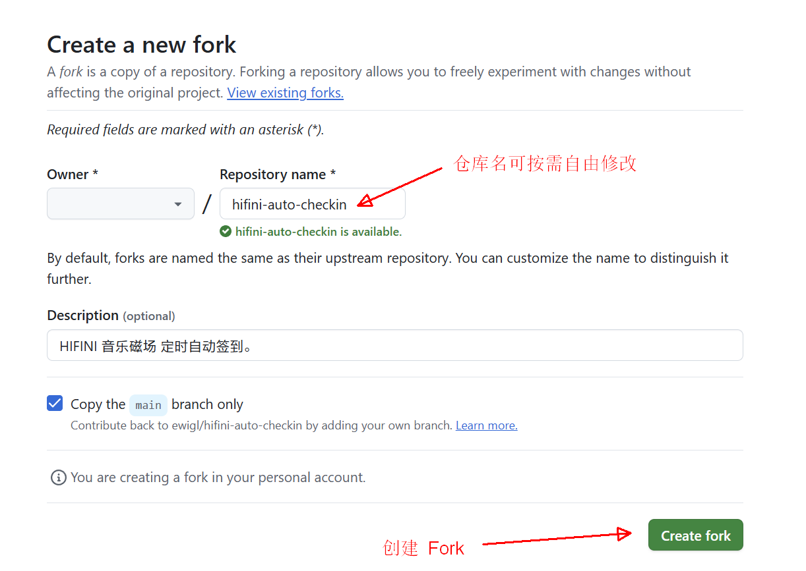
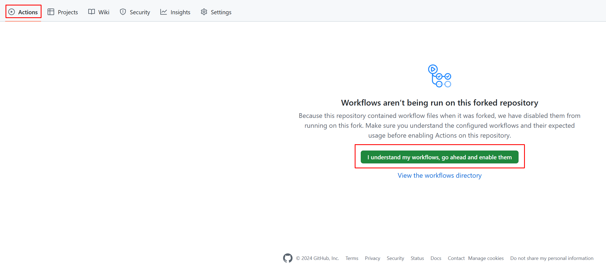
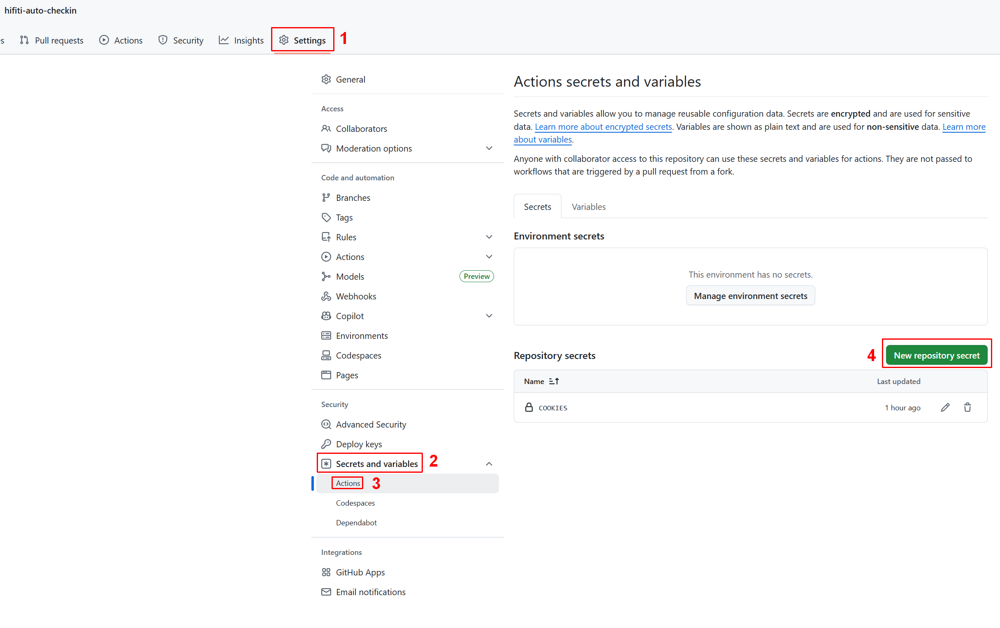
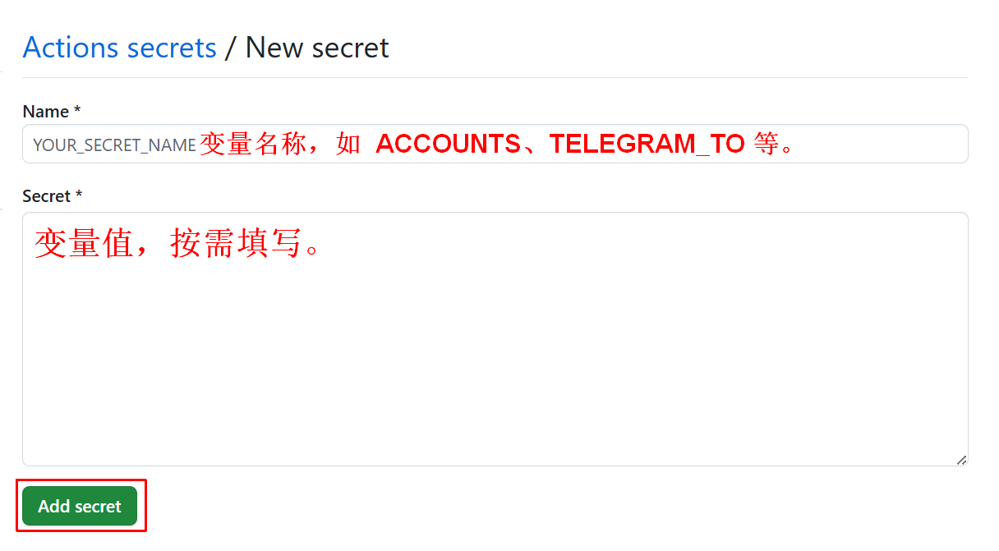
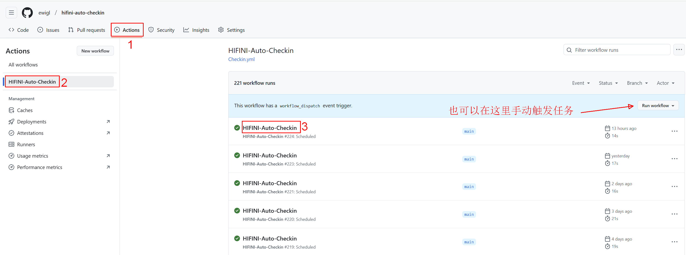
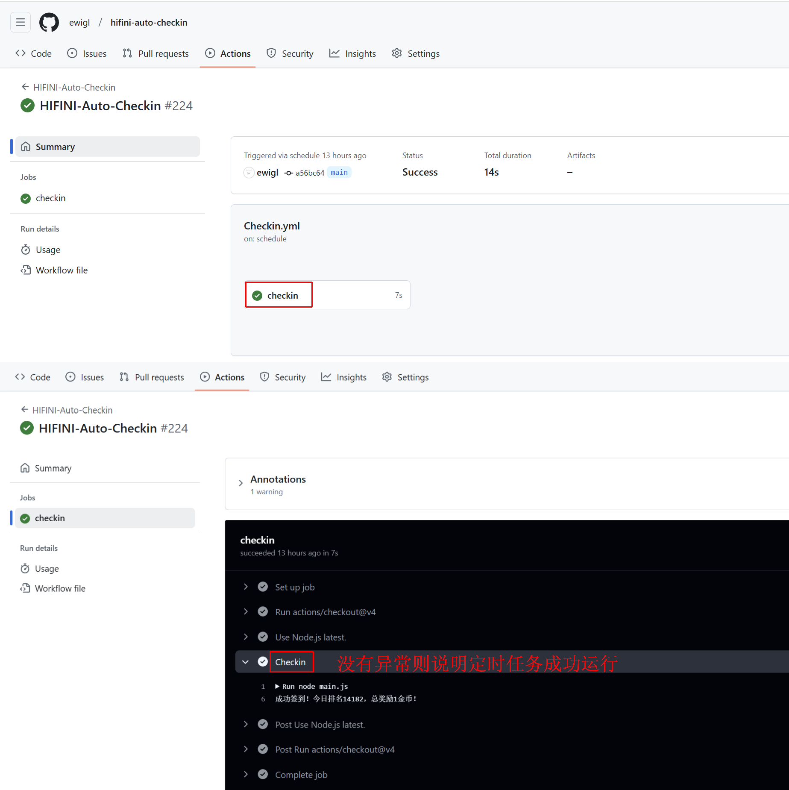
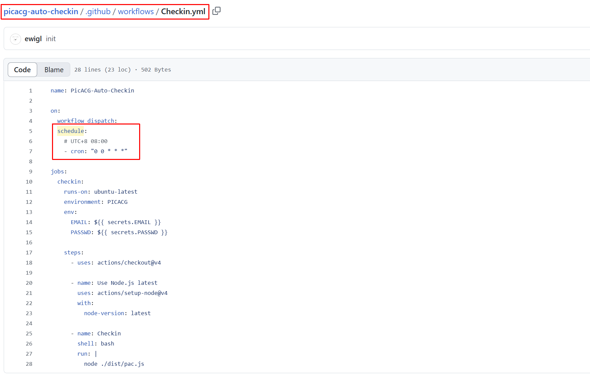

import DocCardList from "@theme/DocCardList";

在 GitHub 的仓库中自动化、自定义和执行软件开发工作流程。

## 使用方法

### 1. Fork 仓库

点击仓库右上角 Fork 按钮将仓库复制到自己的 GitHub 账户。

### 2. 启用 Workflows

在 Fork 后的仓库上方找到 Actions 标签页。启用 Workflows。

### 3. 配置 Actions 变量

首先获取需要用到的变量:

<DocCardList />

在仓库上方找到 Settings 标签页，选择 Secrets and variables。

点击新建，按需配置变量名称以及对应的变量值。

## 常见问题

### 手动执行任务

### 查看运行详情

### 任务运行时间

修改 Checkin.yml 中的时间表即可，希望运行多次添加多行 crontab 即可。

时区为 UTC。且 GitHub Actions 定时任务存在时间延迟。尽量避免将时间设置在高峰时段（零点、八点九点等整点时段）。

## 注意事项

根据 [Github 的政策](https://docs.github.com/zh/actions/managing-workflow-runs-and-deployments/managing-workflow-runs/disabling-and-enabling-a-workflow?tool=webui)，当 60 天内未发生仓库活动时，将自动禁用定时 Workflow。需要再次手动启用。
