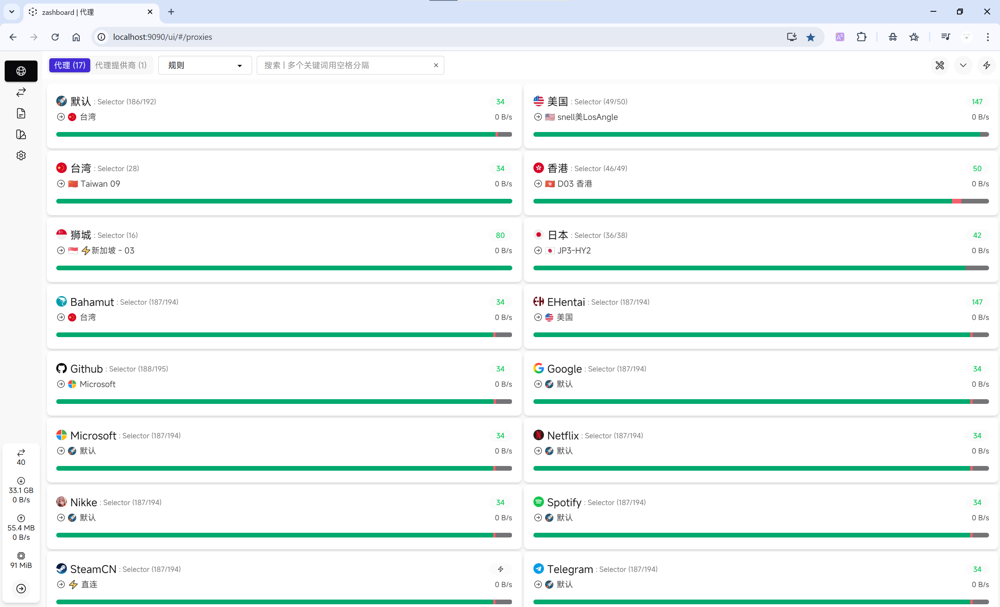
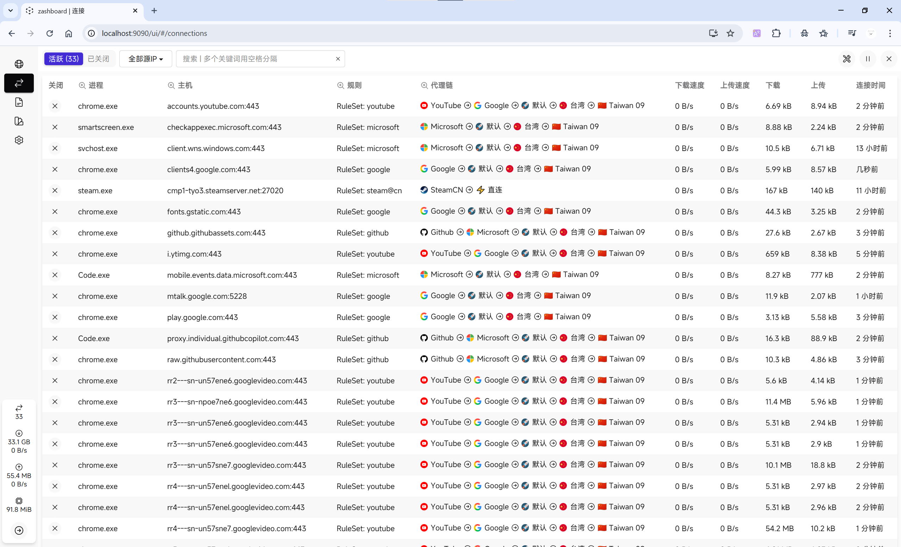
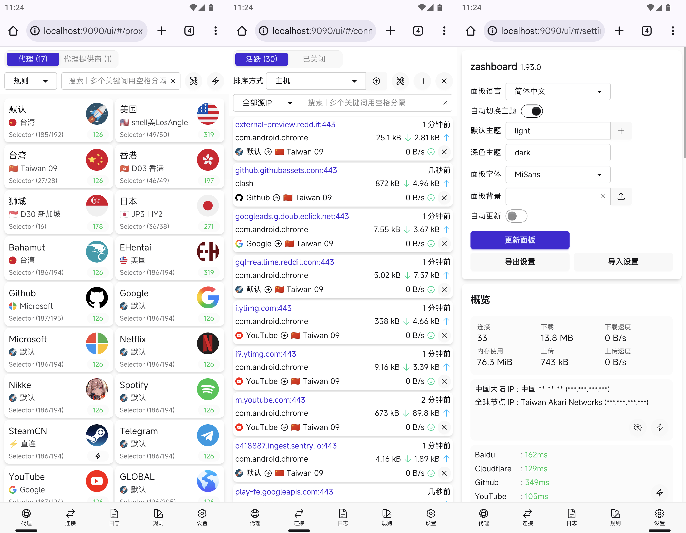

https://github.com/ewigl/mihomo

Mihomo 裸核运行配置文件，用于 Windows 和 [Box for Magisk](https://github.com/taamarin/box_for_magisk) / Root。

- Windows 内核使用 `amd64-v3` 版本。
- Android 内核使用 `arm64-v8` 版本。
- 基于[官方推荐配置](https://wiki.metacubex.one/example/conf/#__tabbed_1_2)，使用[官方规则集](https://github.com/MetaCubeX/meta-rules-dat)。
- WEB UI 使用 [Zashboard](https://github.com/Zephyruso/zashboard) 无字体版本。
- 分组[图标](https://github.com/ewigl/licons)来源于网络。
- 参考：[官方文档](https://wiki.metacubex.one/config/)。

<!-- truncate -->

## 预览







## Windows 配置

- 从 [Release](https://github.com/ewigl/mihomo/releases/latest) 下载 windows-\*.zip，解压缩。
- 整理现有文件到如下目录结构。

### 目录结构

```
.
└── D:/Apps/Mihomo/
    ├── config.yaml
    ├── mihomo-windows-amd64.exe
    ├── mihomo.start.vbs
    ├── Mihomo.Startup.xml
    ├── mihomo.stop.bat
    ├── zashboard/
    │   ├── index.html
    │   └── ...
    └── proxies/
        └── Local.yaml
```

### 配置流程

1.  修改 `config.yaml`。

    - 添加订阅链接：在 `config.yaml` 文件中的 `Subscription` 中填上订阅链接，有多个订阅复制多份即可，名称不能重复。

      `config.yaml`文件片段示例：

      ```yaml
      订阅1:
        type: http
        url: 这里填订阅链接
        health-check:
          enable: true
          url: http://www.gstatic.com/generate_204
          interval: 7200

      订阅10086:
        type: http
        url: 这里填订阅链接
        health-check:
          enable: true
          url: http://www.gstatic.com/generate_204
          interval: 7200
      ```

2.  在 `mihomo-windows-amd64.exe` 上右键 -> 属性 -> 兼容性，勾选“以管理员权限身份运行此程序” **（Tun 模式需要管理员权限）**。
3.  双击 `mihomo.start.vbs` 运行。
4.  浏览器访问控制台：[http://localhost:9090/ui](http://localhost:9090/ui)。

### 开机自启

1. 打开 Windows 任务计划程序
2. 导入 `Mihomo.Startup.xml`，或新建一个任务来开机运行 `mihomo.start.vbs`.
3. 按需修改任务名称、**文件路径**、触发器、条件等等。
4. **在“常规”选项卡中， 勾选“使用最高权限运行”**。（如果不设置此选项，每次启动会跳出 UAC 窗口）

### 停止运行

双击运行 `mihomo.stop.bat`。

或打开任务管理器，结束 `mihomo-windows-amd64.exe`。

## Android 配置

0. 获取手机 Root 权限。
1. 下载 [Box for Root](https://github.com/taamarin/box_for_magisk/releases)，使用 Magisk / KernelSU / Apatch 刷入 Box For Root，**无需立刻重启**。
2. 从 [Release](https://github.com/ewigl/mihomo/releases/latest) 下载 android-\*.zip。
3. 解压缩。
4. 整理现有文件到如下目录结构，`/data/adb/box/`为绝对路径。

### 目录结构

```
.
└── /data/adb/box/
    ├── bin/
    │   └── xclash/
    │       └── mihomo
    └── clash/
        ├── proxies/
        ├── zashboard/
        └── config.yaml
```

### 配置流程

1.  修改 `config.yaml`。（参考 Windows 配置流程）
2.  【可选】修改 `/data/adb/box` 中的 `settings.ini`，将 `network_mode` 设置为 “tun”。
3.  重启。
4.  浏览器访问控制台：[http://localhost:9090/ui](http://localhost:9090/ui)。

### 注意事项

2.  在 APatch、Magisk、KernelSU 的模块管理界面, 可以通过“执行”按钮开关 mihomo。
3.  Log 文件在 `/data/adb/box/run` 文件夹中。

## WARNING

这是实现 Tun 模式的简单配置，使用默认 DNS，使用 MetaCubeX 默认规则集，更多定制功能请参考[官方文档](https://wiki.metacubex.one/)。
